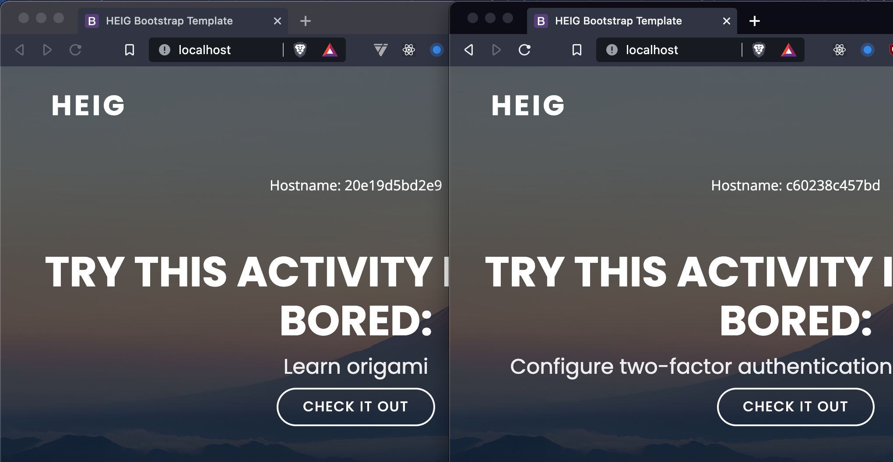
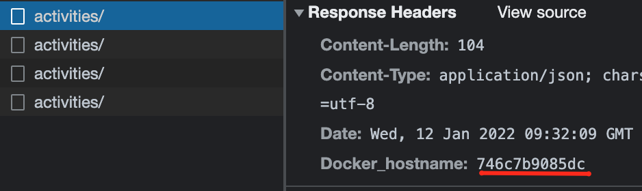
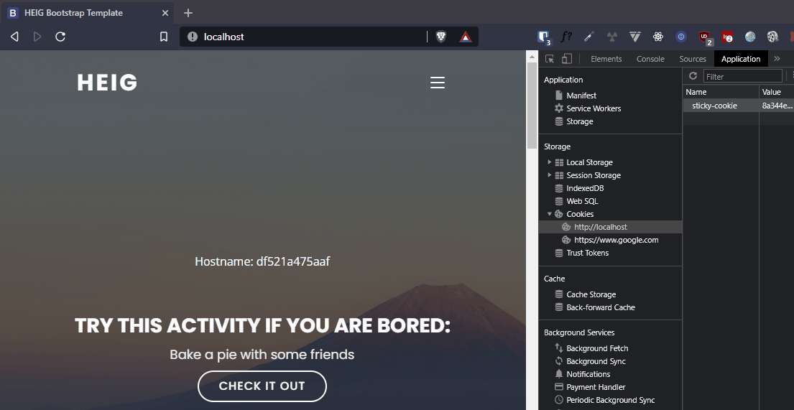

# Labo HTTP Infra

Auteurs: Lazar Pavicevic, Valentin Kaelin

## Etape 1: HTTP serveur statique avec apache httpd

Nous utilisons l'image `php:8-apache-bullseye` afin d'avoir, comme dans la vidéo de présentation, une configuration minimale déjà présente.
Les fichiers de notre site statique doivent donc se trouver dans le chemin suivant à l'intérieur du conteneur: `/var/www/html/`.

Nous construisons l'image Docker avec la commande suivante:

```bash
docker build -t api/apache-php-image .
```

Puis, nous pouvons lancer un container et y accèder via [localhost](http://localhost:9090) avec :

```bash
docker run -p 9090:80 api/apache-php-image
```

## Etape 2: Serveur HTTP dynamique avec Node.js

Pour cette étape, nous utilisons [AdonisJS](https://adonisjs.com/) en remplacement d'Express.js. Il s'agit d'un framework moderne, reprenant une architecture similaire à Laravel et offrant la possibilité de coder en Typescript. Comme cette étape ne demande pas énormément de fonctionnalités, nous utilisons une version slim du framework.

Notre application met à disposition sur l'endpoint `/` une liste d'activités à réaliser en cas d'ennui. Nous avons peuplé un fichier `activities.json` contenant une trentaine d'activités grâce à l'API [boredapi.com](https://www.boredapi.com/).
La liste d'activités retournée contient entre 1 et 10 activités aléatoires.

Nous profitons des **multi-stage builds** proposés par Docker pour créer notre image Docker. Nous avons donc deux étapes principales, le _build stage_ et le _run stage_. Chaque étape utilise l'image de base `node:16-alpine`.

Le build stage transpile les fichiers Typescript en Javascript valide pour le runtime de Node.js et prépare le dossier de production que le run stage va utiliser.

Le run stage, par soucis de sécurité, utilise l'utilisateur non-root `node` mis à disposition par l'image de base.

Avant de construire l'image Docker, il est nécessaire de configurer les variables d'environnement de l'application Node.js. Cela se fait en copiant le fichier `.env.example` du dossier `src` en un fichier `.env`:

```bash
cp .env.example .env
```

Nous construisons l'image Docker avec la commande suivante:

```bash
docker build -t api/adonis-image .
```

Puis, nous pouvons lancer un container et y accèder via [localhost](http://localhost:3333) avec :

```bash
docker run -p 3333:3333 api/adonis-image
```

## Etape 3: Reverse proxy avec Apache (configuration statique)

Nous nous sommes un peu éloignés du tutoriel des webcasts en utilisant `docker compose` pour lancer nos containers. En revanche, le reverse-proxy utilisé ainsi que sa configuration sont ceux des vidéos et réutilisent l'image `php:8-apache-bullseye` de la première étape.

Notre fichier `docker-compose.yml` contient la configuration d'un sous-réseau et de trois services qui sont:

- Le reverse-proxy Apache
- L'API Adonis retournant des activités
- Le site statique servi par Apache

Seul le reverse-proxy est accessible par la machine host via le port 80. Ceci est possible car nous avons spécifié les ports accessibles à la ligne suivante:

```Docker
  apache-reverse-proxy:
    ...
    ports:
      - "80:80"
```

Pour la configuration du reverse-proxy, nous avons profité de la fonctionnalité très pratique de mapping des adresses IP avec le nom des containers proposé par docker compose. Du coup, dans le fichier `001-reverse-proxy.conf`, les `ProxyPass` mappent les routes vers les containers en utilisant leur nom (et port) plutôt qu'une adresse IP en dur.

```
  ProxyPass "/api/activities/" "http://docker-activities:3333/"
  ProxyPassReverse "/api/activities/" "http://docker-activities:3333/"

  ProxyPass "/" "http://docker-static:80/"
  ProxyPassReverse "/" "http://docker-static:80/"
```

La configuration est donc bien plus robuste.

Afin de vérifier que les containers du serveur statique et du serveur dynamique ne sont pas accessibles directement nous avons réalisé plusieurs procédures.  
Tout d'abord, nous avons accédé directement à l'ip du service Docker dans notre navigateur (0.0.0.0 sur Mac et 10.192.93.80 sous Windows (`host.docker.internal` dans le fichier hosts)). Apache nous renvoie dans ce cas la page d'erreur Forbidden car il s'agit de la configuration vide `000-default.conf` qui est prise en compte. Si l'on essaie par la suite d'accéder au port 3333 (le port de l'application node), cela ne fonctionne également pas car il n'est pas exposé.

Pour tester la configuration et lancer les containers, il est nécessaire d'exécuter la commande suivante dans le dossier `apache-reverse-proxy-image`:

| :warning: Les deux images des étapes précédentes doivent déjà être build! |
| ------------------------------------------------------------------------- |

```bash
docker compose up -d
```

Par la suite, les différents services sont disponibles aux adresses suivantes:

- [localhost](http://localhost) pour le site statique
- [localhost/api/activities/](http://localhost/api/activities/) pour le site node proposant des activités

Pour arrêter et détruire les containers:

```bash
docker compose down
```

## Etape 4: Requêtes AJAX avec fetch

Nous avons modifié le site web utilisé dans la première étape en lui rajoutant un fichier `custom.js` qui contient la logique pour fetch périodiquement les données fournies par notre API d'activités.

Plutôt que d'utiliser la version `Ajax` de jQuery, nous privilégeons la [Fetch API](https://developer.mozilla.org/en-US/docs/Web/API/Fetch_API/Using_Fetch), plus moderne et disponible nativement sur Javascript. Cela nous permet d'éviter de télécharger une librairie supplémentaire pour un simple call HTTP.

Côté infrastructure, nous reprenons le fichier `docker-compose.yml` de l'étape précédente.

Pour vérifier le bon fonctionnement des appels effectués par le site statique, nous n'avons qu'à nous rendre sur la [page d'accueil](http://localhost) et observer les changements périodiques.

GIF du call ajax se faisant toutes les 3 secondes pour afficher une nouvelle activité:


## Etape 5: Reverse proxy dynamique

Nous n'avons pas à faire grand chose pour cette partie car notre choix d'utiliser `docker compose` à l'étape 3 nous a déjà permis de résoudre le problème des adresses IP statiques liées aux containers. La partie 3 explique assez bien comment le mapping dynamique est géré.

## Etapes optionnelles:

Pour cette partie, nous utilisons Traefik comme Reverse-Proxy afin de profiter de ses fonctionnalités avancées de routage sur les containers. Nous avons créé un dossier `traefik` dans lequel se trouve le `docker-compose.yml` qui implémente toutes les fonctionnalités demandées.

Le fichier docker-compose comporte 4 services : le Reverse-Proxy Traefik, Portainer qui sert d'interface de gestion des containers et les deux services développés aux étapes précédentes qui représentent le site web.

La configuation de Traefik est la suivante:

```yml
 traefik:
    container_name: traefik
    image: traefik:2.5
    restart: always
    ports:
      - 80:80
    command:
      - --api.dashboard=true
      - --providers.docker=true
      - --providers.docker.endpoint=unix:///var/run/docker.sock
      # Force à spécifier les services qui peuvent être exposés à Traefik
      - --providers.docker.exposedbydefault=false
      - --providers.docker.network=api_net
      # Crée un entrypoint http nommé "web" utilisé par tous les services qui le spécifie
      - --entrypoints.web.address=:80
    labels:
      - traefik.enable=true
      # Dashboard accessible depuis http://dashboard.localhost
      - traefik.http.routers.dashboard.rule=Host(`dashboard.localhost`)
      - traefik.http.routers.dashboard.service=api@internal
    volumes:
      - /var/run/docker.sock:/var/run/docker.sock
    networks:
      - api_net
```

Les autres services suivent le pattern suivant (avec plus ou moins de différences en fonction des besoins):

```yml
    mon-service:
    image: mon-image
    labels:
      # Permet d'exposer le container à traefik et donc d'effectuer le routage
      - traefik.enable=true
      - traefik.http.routers.mon-service.rule=Host(`localhost`)
      - traefik.http.routers.mon-service.entrypoints=web
      # Avec les deux lignes du dessus, le service est atteignable en http://localhost
    depends_on:
      - traefik
    networks:
      - mon-network
```

Il est important de noter que pour implémenter le scaling des services, il **ne faut pas** spécifier un `container_name` pour chaque service. En effet, nous verrons par la suite que Docker va automatiquement choisir un nom de container reprenant le nom du service et y ajouter un numéro pour le différencier des autres instances du service.

### Load-balancing : Plusieurs nodes

Pour lancer plusieurs containers de nos services, nous exécutons la commande suivante:

```bash
docker compose up --scale adonis-activities=4 --scale apache-php=4
```

Pour vérifier que les requêtes au serveur statique sont bien traitées par des containers différents, nous affichons désormais le hostname en haut de la page web. Pour réaliser cela, nous avons dû remplacer notre fichier `index.html` par un fichier `index.php`. Dans celui-ci, nous récupérons et affichons le hostname grâce à la fonction `gethostname()`.




Du côté de l'API, nous avons ajouté un middleware s'exécutant à chaque requête de notre API Node.js qui ajoute un header `docker_hostname` à la réponse. Cet header contient l'hostname du container.

```js
import { HttpContextContract } from '@ioc:Adonis/Core/HttpContext'
import os from 'os'

export default class Hostname {
  public async handle({ response }: HttpContextContract, next: () => Promise<void>) {
    response.safeHeader('docker_hostname', os.hostname())
    await next()
  }
}
```

Il est maintenant possible d'observer que les requêtes du client à l'api Node.js sont bien traitées par plusieurs containers différents en vérifiant via l'onglet Network les entêtes de la réponse:




### Load balancing: round-robin vs sticky sessions

TODO: expliquer la ligne en plus dans le fichier yml



Nous observons bien sur la vidéo que lorsque le cookie de session est présent, la requête est toujours traitée par le même container. Une fois ce cookie supprimé, Traefik nous assigne un container parmi ceux disponibles.

TODO: montrer que ça ne change pas pour les calls à l'API

### UI de Management

-> Portainer


TODO:

Adonis:

- *OK* Afficher le host dans le json de réponse ou dans le header
- *OK* Gérer l'endpoint /activities (différences entre Apache et Traefik) et ajouter un catch all
- *OK* Fournir des health checks

Traefik:

- *OK* Activer les sticky sessions & round-robin
- Setup de Portainer
- Tester tout le setup final
