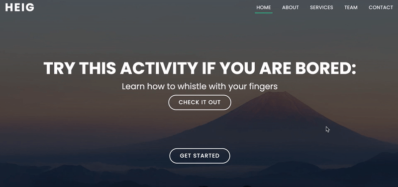

# Labo HTTP Infra

Auteurs: Lazar Pavicevic, Valentin Kaelin

## Etape 1: HTTP serveur statique avec apache httpd

Nous utilisons l'image `php:8-apache-bullseye` afin d'avoir, comme dans la vidéo de présentation, une configuration minimale déjà présente.
Les fichiers de notre site statique doivent donc se trouver dans le chemin suivant à l'intérieur du conteneur: `/var/www/html/`.

Nous construisons l'image Docker avec la commande suivante:

```bash
docker build -t api/apache-php-image .
```

Puis, nous pouvons lancer un container et y accéder via [localhost](http://localhost:9090) avec :

```bash
docker run -p 9090:80 api/apache-php-image
```

## Etape 2: Serveur HTTP dynamique avec Node.js

Pour cette étape, nous utilisons [AdonisJS](https://adonisjs.com/) en remplacement d'Express.js. Il s'agit d'un framework moderne, reprenant une architecture similaire à Laravel et offrant la possibilité de coder en Typescript. Comme cette étape ne demande pas énormément de fonctionnalités, nous utilisons une version slim du framework.

Notre application met à disposition sur l'endpoint `/` une liste d'activités à réaliser en cas d'ennui. Nous avons peuplé un fichier `activities.json` contenant une trentaine d'activités grâce à l'API [boredapi.com](https://www.boredapi.com/).
La liste d'activités retournée contient entre 1 et 10 activités aléatoires.

Nous profitons des **multi-stage builds** proposés par Docker pour créer notre image Docker. Nous avons donc deux étapes principales, le _build stage_ et le _run stage_. Chaque étape utilise l'image de base `node:16-alpine`.

Le build stage transpile les fichiers Typescript en Javascript valide pour le runtime de Node.js et prépare le dossier de production que le run stage va utiliser.

Le run stage, par soucis de sécurité, utilise l'utilisateur non-root `node` mis à disposition par l'image de base.

Avant de construire l'image Docker, il est nécessaire de configurer les variables d'environnement de l'application Node.js. Cela se fait en copiant le fichier `.env.example` du dossier `src` en un fichier `.env`:

```bash
cp .env.example .env
```

Nous construisons l'image Docker avec la commande suivante:

```bash
docker build -t api/adonis-image .
```

Puis, nous pouvons lancer un container et y accèder via [localhost](http://localhost:3333) avec :

```bash
docker run -p 3333:3333 api/adonis-image
```

## Etape 3: Reverse proxy avec Apache (configuration statique)

Nous nous sommes un peu éloignés du tutoriel des webcasts en utilisant `docker compose` pour lancer nos containers. En revanche, le reverse-proxy utilisé ainsi que sa configuration sont ceux des vidéos et réutilisent l'image `php:8-apache-bullseye` de la première étape.

Notre fichier `docker-compose.yml` contient la configuration d'un sous-réseau et de trois services qui sont:

- Le reverse-proxy Apache
- L'API Adonis retournant des activités
- Le site statique servi par Apache

Seul le reverse-proxy est accessible par la machine host via le port 80. Ceci est possible car nous avons spécifié les ports accessibles à la ligne suivante:

```Docker
  apache-reverse-proxy:
    ...
    ports:
      - "80:80"
```

Pour la configuration du reverse-proxy, nous avons profité de la fonctionnalité très pratique de mapping des adresses IP avec le nom des containers proposé par docker compose. Du coup, dans le fichier `001-reverse-proxy.conf`, les `ProxyPass` mappent les routes vers les containers en utilisant leur nom (et port) plutôt qu'une adresse IP en dur.

```
  ProxyPass "/api/activities/" "http://docker-activities:3333/"
  ProxyPassReverse "/api/activities/" "http://docker-activities:3333/"

  ProxyPass "/" "http://docker-static:80/"
  ProxyPassReverse "/" "http://docker-static:80/"
```

La configuration est donc bien plus robuste.

Afin de vérifier que les containers du serveur statique et du serveur dynamique ne sont pas accessibles directement nous avons réalisé plusieurs procédures.  
Tout d'abord, nous avons accédé directement à l'ip du service Docker dans notre navigateur (0.0.0.0 sur Mac et 10.192.93.80 sous Windows (`host.docker.internal` dans le fichier hosts)). Apache nous renvoie dans ce cas la page d'erreur Forbidden car il s'agit de la configuration vide `000-default.conf` qui est prise en compte. Si l'on essaie par la suite d'accéder au port 3333 (le port de l'application node), cela ne fonctionne également pas car il n'est pas exposé.

Pour tester la configuration et lancer les containers, il est nécessaire d'exécuter la commande suivante dans le dossier `apache-reverse-proxy-image`:

Il est possible de build les images via la commande si cela n'a pas été fait au préalable:

```bash
docker compose build
```

```bash
docker compose up -d
```

Par la suite, les différents services sont disponibles aux adresses suivantes:

- [localhost](http://localhost) pour le site statique
- [localhost/api/activities/](http://localhost/api/activities/) pour le site node proposant des activités

Pour arrêter et détruire les containers:

```bash
docker compose down
```

## Etape 4: Requêtes AJAX avec fetch

Nous avons modifié le site web utilisé dans la première étape en lui rajoutant un fichier `custom.js` qui contient la logique pour fetch périodiquement les données fournies par notre API d'activités.

Plutôt que d'utiliser la version `Ajax` de jQuery, nous privilégions la [Fetch API](https://developer.mozilla.org/en-US/docs/Web/API/Fetch_API/Using_Fetch), plus moderne et disponible nativement sur Javascript. Cela nous permet d'éviter de télécharger une librairie supplémentaire pour un simple call HTTP.

Côté infrastructure, nous reprenons le fichier `docker-compose.yml` de l'étape précédente.

Pour vérifier le bon fonctionnement des appels effectués par le site statique, nous n'avons qu'à nous rendre sur la [page d'accueil](http://localhost) et observer les changements périodiques.

GIF du call ajax se faisant toutes les 3 secondes pour afficher une nouvelle activité:

